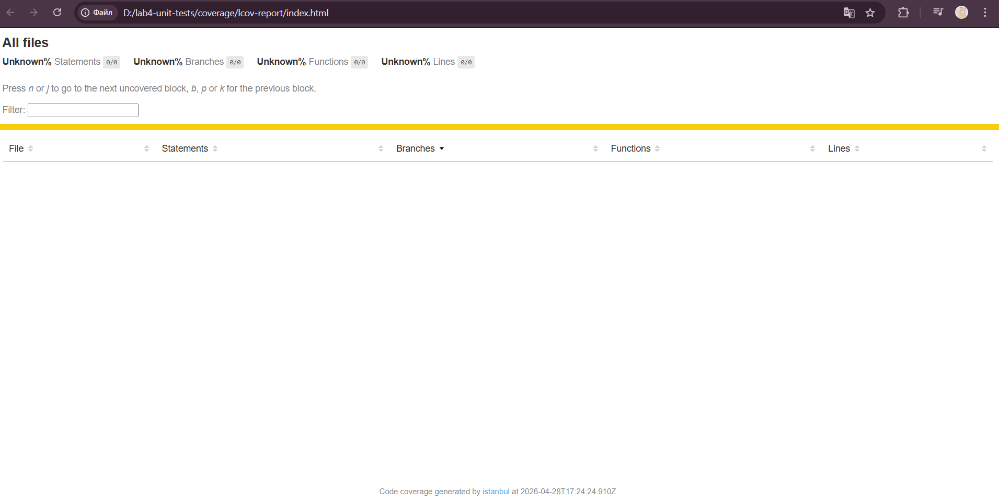

# Unit Testing: Subscription Service (Lab 4)

## Опис проекту
Сервіс для управління підписками користувачів (Варіант 1), написаний на TypeScript з використанням Jest для тестування.

## Функціонал:
- Підписка на плани (free, basic, premium).
- Upgrade плану (з захистом від downgrade).
- Перевірка доступності функцій за планом.

## Як запустити тести:
1. `npm install`
2. `npx jest --coverage`

## Звіт про покриття (Code Coverage):

## AI-генерація:
Початкова логіка тестів була згенерована за допомогою AI та адаптована під AAA патерн (Arrange-Act-Assert).
